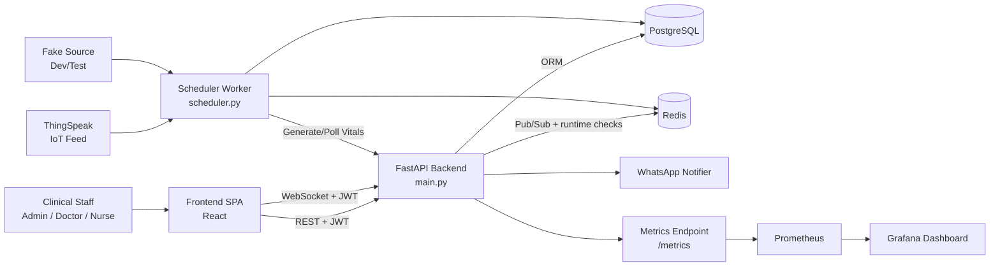
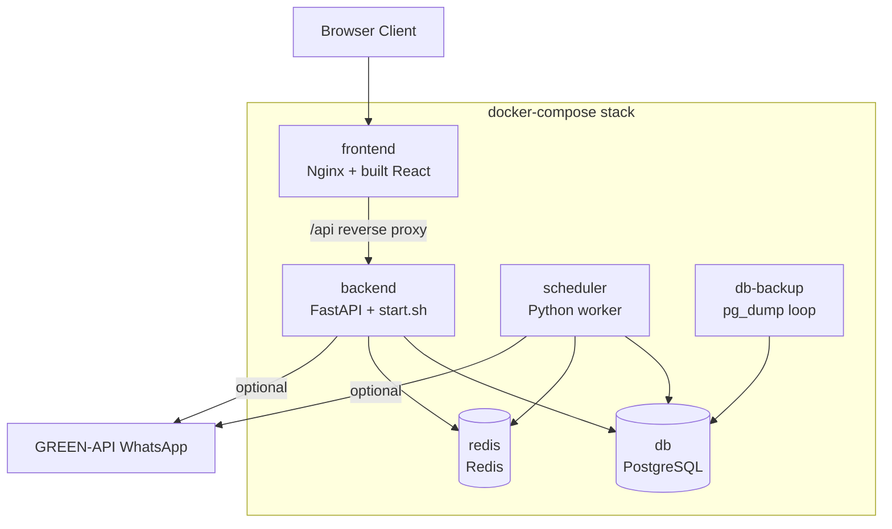
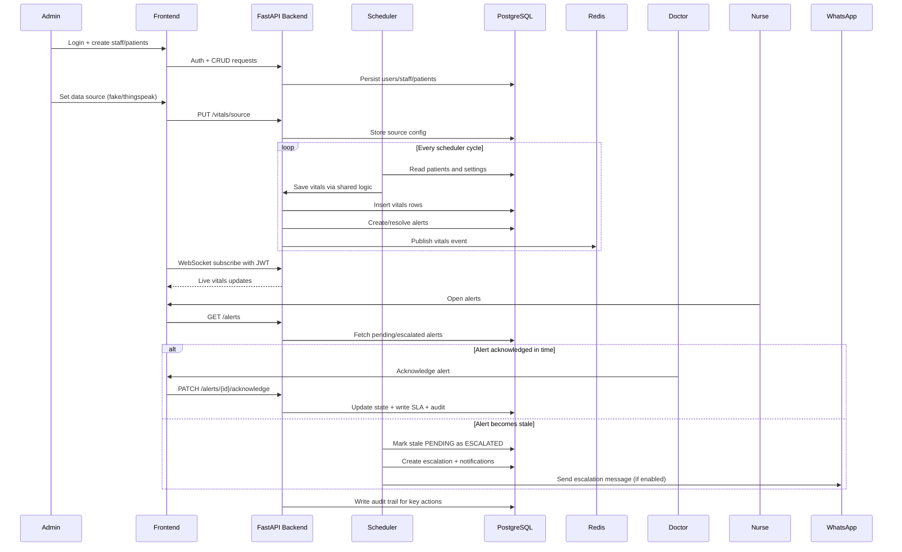
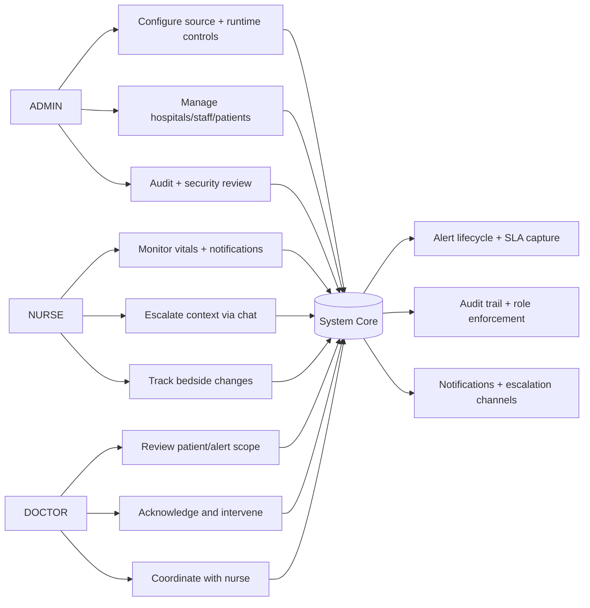
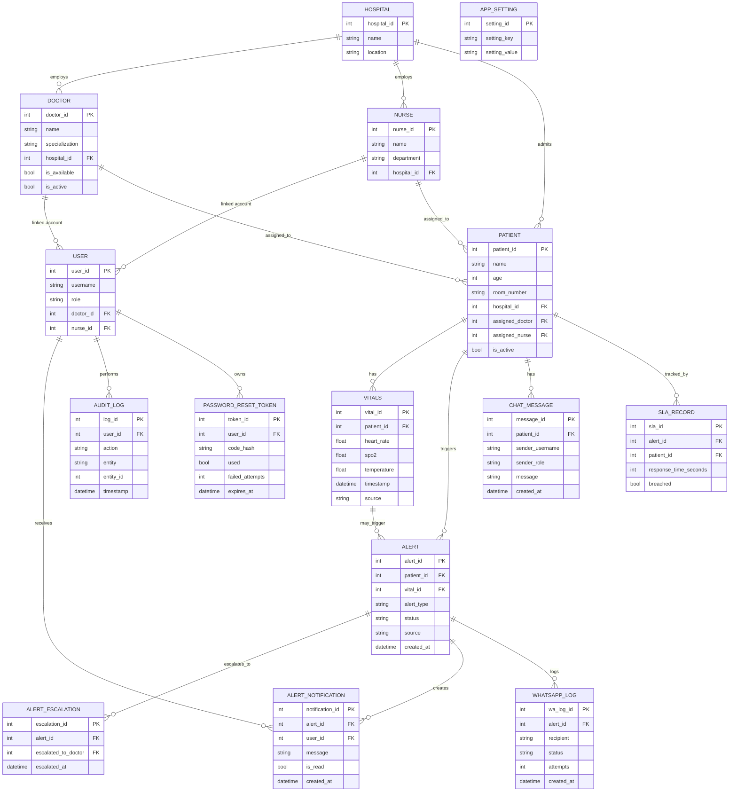
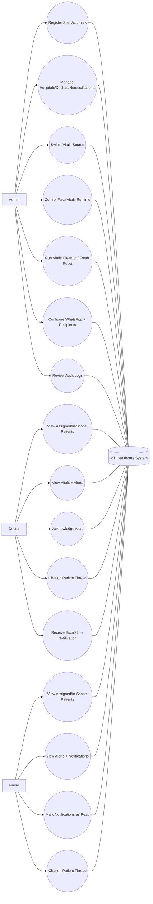

# IoT Healthcare Patient Monitor

Production-focused platform for near real-time patient vitals monitoring, alerting,
escalation, secure staff workflows, and operational visibility.

This README is intentionally detailed and long-form.
It is written to function as both:
- an onboarding guide for developers and operators,
- and a practical runbook for production operations.

-------------------------------------------------------------------------------

## 1. Table of Contents

1. Project Vision and Scope
2. Core Capabilities
3. System Architecture
4. Runtime Components
5. Repository Layout
6. Technology Stack
7. Local Development Setup
8. Environment Variables
9. Data Source Modes
10. Authentication and Session Model
11. Role-Based Access Model
12. Vitals, Alerts, and Escalation Flow
13. WhatsApp Integration Model
14. API Reference Overview
15. API Endpoints by Domain
16. WebSocket Reference
17. Scheduler Runtime Behavior
18. Database Model Summary
19. Auditing and Security Events
20. Admin Runtime Controls
21. Health and Monitoring Endpoints
22. Metrics and Observability
23. Logging Strategy
24. Testing Strategy
25. Linting and Code Quality
26. Docker and Compose Usage
27. Production Hardening
28. CI/CD Workflow
29. GHCR Image Publishing
30. Frontend Runtime Configuration
31. Deployment Options
32. Backup and Data Retention
33. Troubleshooting Playbook
34. Performance and Scaling Notes
35. Security Checklist
36. Developer Workflow Checklist
37. Operator Checklist
38. Upgrade and Migration Notes
39. FAQ
40. Appendix A: Endpoint Matrix
41. Appendix B: Environment Variable Matrix
42. Appendix C: Example Payloads
43. Appendix D: Incident Templates
44. License

-------------------------------------------------------------------------------

## 2. Project Vision and Scope

The system targets healthcare monitoring workflows where patient vitals must be:
- ingested quickly,
- evaluated against thresholds,
- surfaced to staff by role,
- and escalated when acknowledgements are delayed.

Primary goals:
- Make abnormal patient trends visible quickly.
- Reduce time-to-acknowledgement for risk events.
- Provide auditable role-based operations.
- Support both simulated and hardware-backed vitals sources.
- Keep deployments operationally practical with Docker Compose.

Non-goals:
- This project is not a replacement for certified medical device software.
- This project does not claim clinical diagnosis capability.
- This project does not include full EMR integration out of the box.

-------------------------------------------------------------------------------

## 3. Core Capabilities

The platform supports the following capabilities:

1. Vitals capture and persistence.
2. Threshold-based alert generation.
3. Alert de-duplication and state transitions.
4. Automatic escalation for stale pending alerts.
5. Staff notifications and acknowledgement flow.
6. WhatsApp integration for notification delivery.
7. Real-time stream updates over WebSocket.
8. Audit logs for key actions.
9. Role-based authorization for ADMIN, DOCTOR, NURSE.
10. Runtime source switching between fake and ThingSpeak.
11. Runtime controls to start/stop fake vitals generation.
12. Vitals cleanup controls for operational maintenance.
13. Health endpoints and metrics endpoint for monitoring.
14. Redis-backed support for pub/sub and limits.

-------------------------------------------------------------------------------

## 4. System Architecture

At a high level, the system is a modular backend with a separate frontend,
plus supporting data and runtime services.

Core architecture:
- Frontend SPA (React)
- Backend API (FastAPI)
- Database (PostgreSQL)
- Redis (pub/sub + support utilities)
- Scheduler worker loop
- Optional monitoring stack (Prometheus + Grafana)

Data flow summary:
1. Scheduler or API writes vitals rows.
2. Alert engine evaluates vitals against thresholds.
3. Alert rows are created or resolved.
4. Escalation routine updates stale alerts.
5. Notifications are created and optionally delivered via WhatsApp.
6. WebSocket clients receive near real-time updates.

### 4.1 High-Level Architecture Diagram



### 4.2 Container/Runtime Architecture Diagram



### 4.3 Story-Based Working Flow (End-to-End)

This section explains how the platform behaves as a real operational story,
from setup to daily care operations to incident handling.

#### Story 1: First-Day Setup at a New Hospital

Characters:
- Asha (ADMIN)
- Dr. Ravi (DOCTOR)
- Nurse Meena (NURSE)

Chapter 1: System bootstrap
1. Asha deploys the stack.
2. backend/start.sh checks required env variables.
3. If first deployment has no admin, seeding requires ADMIN_PASSWORD.
4. API starts and exposes health endpoints.

Chapter 2: Structural onboarding
1. Asha logs in as ADMIN.
2. Asha creates hospital records.
3. Asha creates doctor and nurse profiles.
4. Asha creates user accounts linked to those staff profiles.
5. Asha creates patient records and assigns staff.

Chapter 3: Data source selection
1. Asha opens System Status page.
2. Asha selects source mode:
   - fake for simulation,
   - thingspeak for real hardware feed.
3. Backend persists source config.
4. Scheduler starts using that source in the next cycle.

Outcome of Story 1:
- Identity model is ready.
- Care teams are mapped to patients.
- Vitals ingestion path is active.

#### Story 2: Normal Clinical Shift (No Major Incidents)

Characters:
- Dr. Ravi
- Nurse Meena

Chapter 1: Shift start
1. Doctor and nurse log in.
2. Each user lands on role-appropriate views.
3. Dashboard loads counts and SLA summaries.

Chapter 2: Continuous vitals flow
1. Scheduler reads patients every cycle.
2. Source adapter provides vitals values.
3. Vitals rows are written to DB.
4. Backend publishes updates to WebSocket clients.
5. Frontend updates dashboard and vitals page in near real-time.

Chapter 3: Routine care collaboration
1. Nurse opens patient timeline and notes issue.
2. Nurse posts message in patient chat.
3. Doctor sees message in same patient thread.
4. Doctor responds and adjusts care instructions.

Outcome of Story 2:
- Continuous monitoring works without manual polling.
- Chat and dashboard keep staff synchronized.

#### Story 3: Abnormal Vitals and Alert Escalation

Characters:
- Patient P-104
- Nurse Meena
- Dr. Ravi
- Backup doctor on same hospital floor

Chapter 1: Trigger
1. New vital arrives with low SpO2 and high temperature.
2. alert_engine evaluates thresholds.
3. System creates alert with PENDING state.
4. Notification records are generated for relevant staff.

Chapter 2: Initial response window
1. Nurse sees new alert badge.
2. Doctor sees alert in active list.
3. If acknowledged quickly, alert moves to ACKNOWLEDGED.
4. SLA record captures response time.

Chapter 3: Escalation path (if no timely acknowledgement)
1. Scheduler finds stale PENDING alert older than threshold.
2. Alert state becomes ESCALATED.
3. Escalation records are created for alternate doctors.
4. In-app notifications are generated.
5. WhatsApp escalation flow executes if enabled.

Chapter 4: Clinical closure
1. Doctor acknowledges and begins intervention.
2. As vitals normalize, alert lifecycle resolves.
3. Audit logs preserve who did what and when.

Outcome of Story 3:
- No silent failure for unattended critical alerts.
- Escalation provides redundancy in clinical response.

#### Story 4: Security Event During Busy Hours

Characters:
- Unknown attacker IP
- Real nurse user

Chapter 1: Suspicious login attempts
1. Multiple invalid passwords are submitted rapidly.
2. Failed-login counters increment.
3. IP enters temporary blocked state after threshold.

Chapter 2: Legitimate user impact protection
1. Real nurse logs in from normal device.
2. Session binding logic validates refresh behavior.
3. Suspicious token activity emits security events.

Chapter 3: Operator response
1. Admin checks audit and security logs.
2. Admin confirms no unauthorized account changes.
3. Shift continues with controlled risk.

Outcome of Story 4:
- Abuse controls reduce brute-force risk.
- Session checks reduce refresh-token misuse risk.

#### Story 5: Maintenance Window and Data Hygiene

Characters:
- Asha (ADMIN)

Chapter 1: Runtime control
1. Asha disables fake generation for a maintenance test.
2. Scheduler respects toggle for fake mode.

Chapter 2: Cleanup operation
1. Asha runs vitals cleanup endpoint with selected scope.
2. Old non-essential data is removed safely.
3. Active operational data remains available.

Chapter 3: Controlled reset in non-production
1. Asha uses fresh-reset endpoint in test environment.
2. System wipes selected domain data.
3. Fake vitals toggle resets to safe default.

Outcome of Story 5:
- Maintenance tasks are explicit, auditable, and role-gated.

#### Story 6: End-to-End Sequence Diagram



#### Story 7: Executive Summary of the Narrative

1. Admin establishes structure and policy.
2. Scheduler and backend keep telemetry moving.
3. Staff consume live context and respond quickly.
4. Escalation closes response gaps when primary acknowledgement delays occur.
5. Security controls protect the system during hostile traffic.
6. Maintenance endpoints keep long-term operations manageable.

This is the complete working story of the platform from provisioning to clinical response to operational resilience.

-------------------------------------------------------------------------------

## 5. Runtime Components

### 5.1 Backend API
- Framework: FastAPI
- Main module: backend/main.py
- Responsibilities:
	- auth and role checks,
	- CRUD endpoints,
	- dashboard stats,
	- operational controls,
	- health and metrics,
	- WebSocket session handling.

### 5.2 Scheduler Process
- Module: backend/scheduler.py
- Responsibilities:
	- periodic vitals generation or polling based on active source,
	- stale alert escalation,
	- Redis publishing for live stream updates.

### 5.3 PostgreSQL
- Stores core entities:
	- users,
	- hospitals,
	- doctors,
	- nurses,
	- patients,
	- vitals,
	- alerts,
	- escalations,
	- notifications,
	- audit logs,
	- settings,
	- password reset tokens,
	- WhatsApp logs.

### 5.4 Redis
- Used by:
	- pub/sub live event fanout,
	- runtime checks and optional support paths.

### 5.5 Frontend
- Module root: frontend/src
- Responsibilities:
	- user login and session flow,
	- role-aware pages,
	- dashboard and alerts visibility,
	- system status controls,
	- WhatsApp config interactions.

-------------------------------------------------------------------------------

## 6. Repository Layout

Top-level structure:

- backend/
- frontend/
- monitoring/
- .github/workflows/
- docker-compose.yml
- docker-compose.prod.yml
- .env.example
- .env.production.example
- README.md

Backend highlights:
- main.py: route and runtime orchestration.
- crud.py: data access and business operations.
- models.py: SQLAlchemy models.
- schemas.py: Pydantic contracts.
- auth.py: auth helpers and token management.
- security_utils.py: abuse protection and session logic.
- scheduler.py: periodic background logic.
- data_sources/: fake and ThingSpeak adapters.
- alert_engine.py: alert threshold evaluation.
- whatsapp_notifier.py: provider integration and logging.
- start.sh: container startup contract.
- tests/: backend test suite.

Frontend highlights:
- src/App.js: route shell and app layout.
- src/api.js: API client utilities.
- src/config.js: runtime base URL resolution.
- src/pages/: feature pages.

Monitoring highlights:
- Prometheus config.
- Grafana provisioning and dashboard JSON.

-------------------------------------------------------------------------------

## 7. Technology Stack

Backend:
- Python
- FastAPI
- SQLAlchemy
- Pydantic
- python-jose
- bcrypt
- Redis client

Frontend:
- React
- React Router
- Axios

Data and infra:
- PostgreSQL 16
- Redis 7
- Docker
- Docker Compose
- Nginx

Observability:
- Prometheus
- Grafana

Quality and CI:
- pytest
- ruff
- GitHub Actions
- docker/build-push-action

-------------------------------------------------------------------------------

## 8. Local Development Setup

### 8.1 Prerequisites

Required:
- Python 3.12+
- Node.js 20+ recommended
- npm
- PostgreSQL
- Redis

Optional:
- Docker Desktop

### 8.2 Backend Setup

From repository root:

```bash
cd backend
python -m venv venv
source venv/bin/activate
pip install --upgrade pip
pip install -r requirements.txt
cp .env.example .env
```

Set required variables in backend/.env:
- DATABASE_URL
- SECRET_KEY
- ADMIN_PASSWORD

Initialize and start:

```bash
python seed_db.py
uvicorn main:app --host 0.0.0.0 --port 8000
```

### 8.3 Scheduler Setup

Open separate terminal:

```bash
cd backend
source venv/bin/activate
python scheduler.py
```

### 8.4 Frontend Setup

Open another terminal:

```bash
cd frontend
npm install
npm start
```

### 8.5 Sanity Check

Check:
- Backend health endpoint returns healthy.
- Frontend can log in.
- Dashboard shows vitals data.
- Alert flow triggers for abnormal vitals.

-------------------------------------------------------------------------------

## 9. Environment Variables

The project uses two primary env surfaces:
- root .env for compose services,
- backend/.env for direct backend local runs.

### 9.1 Root Example Variables

Common root-level variables:
- POSTGRES_PASSWORD
- SECRET_KEY
- ADMIN_PASSWORD
- DATA_SOURCE
- CORS_ORIGINS
- GREEN_API_ID
- GREEN_API_TOKEN
- REACT_APP_API_BASE_URL
- REACT_APP_WS_BASE_URL

### 9.2 Backend Example Variables

Database:
- DATABASE_URL

Auth:
- SECRET_KEY
- ACCESS_TOKEN_EXPIRE_MINUTES
- ADMIN_PASSWORD

Data source:
- DATA_SOURCE

ThingSpeak:
- THINGSPEAK_CHANNEL_ID
- THINGSPEAK_READ_API_KEY
- THINGSPEAK_TEMP_UNIT
- THINGSPEAK_STALE_SECONDS

Redis:
- REDIS_URL
- REDIS_REQUIRED

WebSocket controls:
- WS_CONNECTION_LIMIT
- WS_USER_CONNECTION_LIMIT
- WS_MESSAGES_PER_MINUTE
- WS_MESSAGES_PER_SECOND
- WS_BROADCAST_MODE

Security and session controls:
- MAX_SESSIONS_PER_USER
- ALLOW_MOBILE_IP_VARIATION
- SUSPICIOUS_IP_WINDOW_SECONDS
- SUSPICIOUS_REFRESH_WINDOW_SECONDS
- SUSPICIOUS_REFRESH_BURST
- COOKIE_SECURE
- REFRESH_TOKEN_EXPIRE_DAYS
- REFRESH_COOKIE_NAME

Password reset:
- FORGOT_PASSWORD_CODE_TTL_MINUTES

Admin safety controls:
- ALLOW_ADMIN_ALERT_ACK
- ALLOW_DANGEROUS_RESET

WhatsApp controls:
- WHATSAPP_ENABLED
- GREEN_API_ID
- GREEN_API_TOKEN
- GREEN_API_URL
- WHATSAPP_WEBHOOK_SECRET

Performance and data lifecycle:
- SLA_THRESHOLD_SECONDS
- MAX_ALERTS_PER_MINUTE
- VITALS_RETENTION_DAYS

App identity:
- ENVIRONMENT
- SERVICE_NAME
- LOG_LEVEL

-------------------------------------------------------------------------------

## 10. Data Source Modes

The project supports two vitals data modes:

1. fake
2. thingspeak

### 10.1 fake mode

Purpose:
- local development,
- demos,
- test runs without hardware.

Behavior:
- scheduler generates simulated vitals,
- alerts still run through normal pipeline.

### 10.2 thingspeak mode

Purpose:
- hardware-backed telemetry ingestion.

Behavior:
- scheduler uses ThingSpeak adapter,
- stale source fallback behavior governed by env settings.

### 10.3 Runtime Source Switching

Source configuration endpoint:
- GET /vitals/source
- PUT /vitals/source

Contract:
- payload only sets source value,
- ThingSpeak credentials remain env-driven,
- frontend should not send hardware keys via source toggle payload.

-------------------------------------------------------------------------------

## 11. Authentication and Session Model

The auth design uses short-lived access tokens and refresh flow.

### 11.1 Login

User submits credentials.
On success:
- access token is returned in response body,
- refresh token is set as httpOnly cookie.

### 11.2 Refresh

Refresh endpoint validates:
- token structure,
- revocation state,
- binding checks,
- suspicious activity indicators.

### 11.3 Logout

Logout revokes:
- current access token JTI if present,
- refresh token JTI when available.

### 11.4 Password Reset

Flow:
1. request reset code,
2. verify code with expiration and attempts limit,
3. apply new password.

Non-production convenience:
- verification code can be echoed in response for local/dev usage.

### 11.5 Brute-force and Abuse Controls

Controls include:
- failed login counters,
- temporary IP blocking,
- suspicious refresh activity detection,
- session limits per user.

-------------------------------------------------------------------------------

## 12. Role-Based Access Model

Supported roles:
- ADMIN
- DOCTOR
- NURSE

### 12.1 ADMIN

Typical permissions:
- staff/user registration,
- hospital/doctor/nurse/patient management,
- admin runtime controls,
- system-level configuration actions.

### 12.2 DOCTOR

Typical permissions:
- view assigned or in-scope patient data,
- acknowledge alerts if authorized,
- participate in patient chat.

### 12.3 NURSE

Typical permissions:
- view assigned or in-scope patient data,
- receive notifications,
- participate in patient chat.

### 12.4 Authorization Enforcement

Enforced at route layer and operation layer:
- route dependency checks,
- object-scope checks for patient-linked actions,
- explicit behavior constraints for sensitive operations.

### 12.5 Role-Based Working Flows (Story View)

This section explains how each role experiences the platform during an actual shift.

#### ADMIN Flow: Governance and Operational Control

Morning startup story:
1. ADMIN logs in and checks health dashboard endpoints.
2. ADMIN verifies source mode is correct for the day (fake or thingspeak).
3. ADMIN checks hospital roster and active staff assignment quality.

Operations story:
1. ADMIN onboards new doctor and nurse accounts.
2. ADMIN maps these accounts to domain profiles.
3. ADMIN validates patient assignment coverage (no unassigned critical patients).

Risk-control story:
1. ADMIN reviews audit logs for unusual actions.
2. ADMIN reviews suspicious auth events and blocked IP behavior.
3. ADMIN verifies WhatsApp configuration and recipient validity.

Maintenance story:
1. ADMIN may pause fake vitals during testing windows.
2. ADMIN runs vitals cleanup jobs to control data growth.
3. ADMIN uses fresh reset only in explicitly allowed non-production contexts.

ADMIN success metric:
- System remains stable, auditable, and correctly staffed.

#### DOCTOR Flow: Clinical Decision and Alert Ownership

Shift-entry story:
1. DOCTOR logs in and opens dashboard stats.
2. DOCTOR filters patients to assigned or same-hospital scope.
3. DOCTOR reviews active pending and escalated alerts first.

Intervention story:
1. DOCTOR opens patient vitals trend.
2. DOCTOR correlates real-time values with recent alert history.
3. DOCTOR acknowledges alerts when clinical ownership is established.
4. SLA response timing is captured automatically.

Coordination story:
1. DOCTOR communicates in patient chat with nursing staff.
2. DOCTOR updates care direction based on latest readings.
3. If escalation occurred, DOCTOR receives additional notification pressure.

Closure story:
1. Once patient stabilizes, alert status progression resolves.
2. DOCTOR verifies no duplicate unresolved critical events remain.

DOCTOR success metric:
- Time-to-acknowledgement and clinical response quality stay within target.

#### NURSE Flow: Continuous Monitoring and Rapid Escalation Handoff

Ward-monitoring story:
1. NURSE logs in and checks notifications and alerts queue.
2. NURSE monitors vitals list for early warning indicators.
3. NURSE tracks assigned and in-scope patient states continuously.

Action story:
1. NURSE validates bedside context when abnormal vitals appear.
2. NURSE uses patient chat to notify doctor with concise observations.
3. NURSE marks processed notifications as read to keep queue actionable.

Escalation support story:
1. If doctor acknowledgement is delayed, system escalates automatically.
2. NURSE receives escalated context and continues bedside updates.
3. NURSE assists with rapid intervention handoff.

NURSE success metric:
- Faster signal detection and cleaner handoff communication.

### 12.6 Role Interaction Diagram



### 12.7 Role-to-Endpoint Quick Mapping

ADMIN most-used endpoints:
- /auth/register
- /hospitals
- /doctors
- /nurses
- /patients
- /vitals/source
- /admin/fake-vitals/status
- /admin/fake-vitals/force-start
- /admin/fake-vitals/force-stop
- /admin/vitals/cleanup
- /audit-logs

DOCTOR most-used endpoints:
- /auth/login
- /dashboard/stats
- /patients
- /vitals
- /alerts
- /alerts/{alert_id}/acknowledge
- /patients/{patient_id}/chat
- /notifications/my

NURSE most-used endpoints:
- /auth/login
- /dashboard/stats
- /patients
- /vitals
- /alerts
- /notifications/my
- /notifications/{notification_id}/read
- /patients/{patient_id}/chat

-------------------------------------------------------------------------------

## 13. Vitals, Alerts, and Escalation Flow

### 13.1 Vitals Ingestion

Vitals arrive via:
- scheduler source adapter,
- or API endpoint for direct writes.

Each vital row includes:
- patient_id,
- heart_rate,
- spo2,
- temperature,
- timestamp,
- source.

### 13.2 Alert Generation

Threshold checks evaluate the incoming reading.
When abnormal:
- create alert row if no duplicate pending/escalated alert for same type.
When normalized:
- resolve pending/escalated alert rows not currently triggered.

### 13.3 Alert States

Core states:
- PENDING
- ESCALATED
- ACKNOWLEDGED
- RESOLVED

### 13.4 Escalation Logic

Scheduler marks stale pending alerts as escalated.
Then:
- creates escalation records,
- creates notifications for relevant staff,
- triggers WhatsApp escalation message flow when enabled.

### 13.5 SLA Tracking

When alert is acknowledged:
- response_time_seconds is recorded,
- breach flag is recorded based on threshold.

-------------------------------------------------------------------------------

## 14. WhatsApp Integration Model

Integration goals:
- deliver urgent context quickly,
- support escalation communication,
- preserve delivery attempt audit trail.

Key components:
- config and recipient management endpoints,
- test message endpoint,
- webhook endpoint,
- delivery logs endpoint.

Runtime controls:
- pause/resume alerts delivery.

Security note:
- webhook secret support is available,
- ensure WHATSAPP_WEBHOOK_SECRET is set in production.

-------------------------------------------------------------------------------

## 15. API Reference Overview

API domains:
- Auth
- Hospitals
- Doctors
- Nurses
- Patients
- Vitals
- Alerts
- Escalations
- Notifications
- Dashboard
- Chat
- Audit
- Monitoring
- WhatsApp
- Admin Controls
- Health

Request conventions:
- JSON request/response for most endpoints.
- JWT access token in Authorization header for protected routes.
- refresh token in cookie for refresh flow.

-------------------------------------------------------------------------------

## 16. API Endpoints by Domain

### 16.1 Auth

- POST /auth/register
- POST /auth/register/doctor
- POST /auth/register/nurse
- POST /auth/login
- GET /auth/me
- POST /auth/reset-password
- POST /auth/forgot-password/request
- POST /auth/forgot-password/confirm
- POST /auth/forgot-password
- POST /auth/refresh
- POST /auth/logout

### 16.2 Hospitals

- GET /hospitals
- POST /hospitals
- GET /hospitals/{hospital_id}
- DELETE /hospitals/{hospital_id}

### 16.3 Doctors

- GET /doctors
- POST /doctors
- GET /doctors/{doctor_id}
- PUT /doctors/{doctor_id}
- DELETE /doctors/{doctor_id}
- GET /doctors/{doctor_id}/patients

### 16.4 Nurses

- GET /nurses
- POST /nurses
- GET /nurses/{nurse_id}
- PUT /nurses/{nurse_id}
- DELETE /nurses/{nurse_id}
- GET /nurses/{nurse_id}/patients

### 16.5 Patients

- GET /patients
- PUT /patients/{patient_id}
- POST /patients
- GET /patients/{patient_id}
- DELETE /patients/{patient_id}
- PATCH /patients/{patient_id}/assign_doctor
- PATCH /patients/{patient_id}/assign_nurse

### 16.6 Vitals

- POST /vitals
- GET /vitals
- GET /vitals/latest/{patient_id}
- GET /vitals/source
- PUT /vitals/source

### 16.7 Alerts and Escalations

- GET /alerts
- PATCH /alerts/{alert_id}/acknowledge
- GET /escalations

### 16.8 Notifications

- GET /notifications/my
- PATCH /notifications/{notification_id}/read
- POST /notifications/read-all

### 16.9 Dashboard and Chat

- GET /dashboard/stats
- GET /patients/{patient_id}/chat
- POST /patients/{patient_id}/chat

### 16.10 Audit and Monitoring

- GET /audit-logs
- GET /metrics

### 16.11 WhatsApp

- GET /whatsapp/config
- POST /whatsapp/recipients/add
- POST /whatsapp/recipients/remove
- POST /whatsapp/test
- POST /whatsapp/alerts/pause
- POST /whatsapp/alerts/resume
- POST /whatsapp/webhook
- GET /whatsapp/logs

### 16.12 Health

- GET /
- GET /health
- GET /health/db
- GET /health/redis
- GET /health/whatsapp
- GET /health/full

### 16.13 Admin Controls

- GET /admin/fake-vitals/status
- POST /admin/fake-vitals/force-start
- POST /admin/fake-vitals/force-stop
- POST /admin/vitals/cleanup
- POST /admin/reset/fresh

-------------------------------------------------------------------------------

## 17. WebSocket Reference

WebSocket behavior includes:
- authenticated session handling,
- event delivery from pub/sub feed,
- configurable per-user and global connection constraints,
- per-second and per-minute message constraints.

Relevant controls:
- WS_CONNECTION_LIMIT
- WS_USER_CONNECTION_LIMIT
- WS_MESSAGES_PER_MINUTE
- WS_MESSAGES_PER_SECOND
- WS_BROADCAST_MODE

Operational note:
- Redis availability affects event-driven push mode.

-------------------------------------------------------------------------------

## 18. Scheduler Runtime Behavior

The scheduler loop performs periodic tasks:

1. Resolve current source mode.
2. Respect fake generation runtime toggle.
3. Fetch patient list.
4. Produce or fetch vitals per patient.
5. Trigger alert synchronization.
6. Publish vitals snapshot to Redis channel.
7. Escalate stale alerts.

Key tuning variables:
- scheduler interval
- escalation threshold
- source-specific stale behavior

Operational safety:
- process tolerates transient failures per patient.
- loop continues after rollback for isolated row issues.

-------------------------------------------------------------------------------

## 19. Database Model Summary

High-level entity map:

- User
- Hospital
- Doctor
- Nurse
- Patient
- Vitals
- Alert
- AlertEscalation
- AlertNotification
- AuditLog
- ChatMessage
- AppSetting
- SLARecord
- PasswordResetToken
- WhatsAppLog

Relationship summary:
- doctors and nurses link to hospitals.
- patient can link to assigned doctor and nurse.
- vitals and alerts link to patient.
- escalations and notifications link to alerts.
- chat messages link to patient.

### 19.1 ER Diagram



-------------------------------------------------------------------------------

## 20. Auditing and Security Events

Audit trails capture important actions including:
- create/update/delete operations on key domain entities,
- login and password reset operations,
- alert acknowledgements,
- registration workflows.

Security event logging includes:
- failed login activity,
- brute-force block events,
- suspicious refresh activity,
- token theft suspicion indicators.

-------------------------------------------------------------------------------

## 21. Admin Runtime Controls

The system exposes runtime maintenance controls for admin operations.

### 21.1 Fake Vitals Runtime Toggle

Endpoints:
- GET /admin/fake-vitals/status
- POST /admin/fake-vitals/force-start
- POST /admin/fake-vitals/force-stop

Storage:
- app_settings key: fake_vitals_generation_enabled

Behavior:
- scheduler respects this runtime setting in fake source mode.

### 21.2 Vitals Cleanup

Endpoint:
- POST /admin/vitals/cleanup

Supported cleanup modes include time-based and full cleanup options.

### 21.3 Fresh Reset

Endpoint:
- POST /admin/reset/fresh

Safety behavior:
- production reset is blocked unless explicit override is enabled.

-------------------------------------------------------------------------------

## 22. Health and Monitoring Endpoints

Health endpoints:
- GET /health
- GET /health/db
- GET /health/redis
- GET /health/whatsapp
- GET /health/full

Monitoring endpoint:
- GET /metrics

Suggested usage:
- use /health for basic liveness/readiness checks,
- use /health/full for comprehensive composite checks,
- scrape /metrics with Prometheus.

-------------------------------------------------------------------------------

## 23. Metrics and Observability

Current observability strategy combines:
- health probes,
- request-level structured logs,
- simple Prometheus-compatible metrics,
- Grafana dashboard visualization.

Monitoring stack files:
- monitoring/prometheus.yml
- monitoring/grafana/provisioning/datasources/prometheus.yml
- monitoring/grafana/provisioning/dashboards/dashboards.yml
- monitoring/grafana/dashboards/iot-healthcare.json

-------------------------------------------------------------------------------

## 24. Logging Strategy

Logging patterns:
- structured JSON-like context for key request events,
- security-focused event logging for auth anomalies,
- service-level startup and runtime operational logs.

Production recommendations:
- use centralized log collection,
- preserve request id correlation,
- restrict sensitive field exposure,
- rotate logs and set retention policy.

-------------------------------------------------------------------------------

## 25. Testing Strategy

Backend tests live in backend/tests.

Existing coverage includes:
- auth behaviors,
- role permissions,
- alert engine logic,
- scheduler behavior,
- security hardening scenarios,
- admin controls behavior.

Run tests:

```bash
cd backend
source venv/bin/activate
python -m pytest -q
```

-------------------------------------------------------------------------------

## 26. Linting and Code Quality

Lint command:

```bash
cd backend
ruff check . --ignore E501
```

Guidelines:
- keep imports minimal and used,
- avoid dead helper functions,
- keep domain logic in focused modules,
- maintain readable route handlers.

-------------------------------------------------------------------------------

## 27. Docker and Compose Usage

### 27.1 Development Compose

Main file:
- docker-compose.yml

Services:
- db
- redis
- backend
- scheduler
- frontend
- db-backup

Start command:

```bash
docker compose up -d --build
```

### 27.2 Production Override Compose

Override file:
- docker-compose.prod.yml

Behavior in override:
- keeps db and redis internal,
- disables direct backend public port,
- enforces secure env checks,
- tightens container security options.

Production start command:

```bash
cp .env.production.example .env
docker compose -f docker-compose.yml -f docker-compose.prod.yml up -d --build
```

-------------------------------------------------------------------------------

## 28. Backend Startup Contract

Container entrypoint script:
- backend/start.sh

Startup script responsibilities:
- validates DATABASE_URL presence,
- validates SECRET_KEY presence and weak markers,
- runs critical schema update statements,
- handles admin seed behavior based on ADMIN_PASSWORD and existing admin state,
- starts uvicorn.

Operational implications:
- first deploy safety is enforced,
- existing deployments avoid unnecessary seed hard-failure when admin already exists.

-------------------------------------------------------------------------------

## 29. CI/CD Workflow

Workflow file:
- .github/workflows/ci.yml

Pipeline jobs:
- test-backend
- test-frontend
- build-images

Pipeline behavior:
1. backend lint and tests run first,
2. frontend build runs,
3. docker images build and push on main and railway-deploy.

-------------------------------------------------------------------------------

## 30. GHCR Image Publishing

Registry:
- ghcr.io

Published image tags:
- ghcr.io/<repository-lowercase>-backend:latest
- ghcr.io/<repository-lowercase>-frontend:latest

Important implementation detail:
- workflow normalizes repository name to lowercase in build job,
- avoids invalid uppercase tag errors in GHCR.

-------------------------------------------------------------------------------

## 31. Frontend Runtime Configuration

Frontend environment knobs include:
- REACT_APP_API_BASE_URL
- REACT_APP_WS_BASE_URL

Operational note:
- compose defaults REACT_APP_API_BASE_URL to /api for proxied deployments.

-------------------------------------------------------------------------------

## 32. Deployment Options

Typical options:
- Docker Compose on VM,
- cloud container runtime,
- split frontend/backend hosting where needed.

Minimum production recommendations:
- HTTPS termination,
- strong SECRET_KEY,
- strong ADMIN_PASSWORD,
- locked-down CORS_ORIGINS,
- WHATSAPP_WEBHOOK_SECRET configured,
- REDIS_REQUIRED enabled.

-------------------------------------------------------------------------------

## 33. Backup and Data Retention

Compose includes db-backup helper service.

Behavior summary:
- periodic pg_dump snapshots,
- retention cleanup of older backups,
- configurable retention days.

Retention-oriented variables:
- BACKUP_RETENTION_DAYS
- VITALS_RETENTION_DAYS

-------------------------------------------------------------------------------

## 34. Troubleshooting Playbook

### 34.1 Backend fails to start

Check:
- DATABASE_URL set,
- SECRET_KEY set and not weak,
- db reachable,
- redis reachable when REDIS_REQUIRED=true.

### 34.2 Login fails repeatedly

Check:
- credentials,
- IP block state,
- failed login counters,
- system clock skew.

### 34.3 No vitals updates in dashboard

Check:
- scheduler process running,
- active source mode,
- fake-vitals runtime status,
- Redis connectivity for live push.

### 34.4 Alerts not escalating

Check:
- scheduler loop health,
- threshold minutes configuration,
- alert state transitions,
- database writes for escalations.

### 34.5 WhatsApp not sending

Check:
- WHATSAPP_ENABLED=true,
- GREEN_API_ID and GREEN_API_TOKEN set,
- recipient normalization,
- provider reachability,
- webhook secret validation where required.

### 34.6 Frontend cannot call backend

Check:
- base URL settings,
- CORS_ORIGINS,
- proxy path behavior,
- backend container health.

### 34.7 CI build image fails

Check:
- GHCR login permission,
- lowercase image naming,
- workflow branches and conditions,
- Dockerfile context paths.

-------------------------------------------------------------------------------

## 35. Performance and Scaling Notes

Scale dimensions:
- API request concurrency,
- scheduler loop throughput,
- Redis pub/sub fanout,
- DB query efficiency,
- frontend render cost on large patient sets.

Recommended optimizations:
- add indexes for frequent filters,
- monitor query plans for dashboard and alerts,
- separate read/write workloads if growth demands,
- tune WebSocket limits for deployment capacity.

-------------------------------------------------------------------------------

## 36. Security Checklist

Pre-production checklist:
- SECRET_KEY is long and random.
- ADMIN_PASSWORD is strong and unique.
- COOKIE_SECURE=true in production.
- CORS_ORIGINS explicitly configured.
- WHATSAPP_WEBHOOK_SECRET configured.
- ALLOW_DANGEROUS_RESET remains false.
- REDIS_REQUIRED=true for production contract.
- container security options enabled in production override.

Operational checklist:
- monitor failed login spikes,
- monitor suspicious refresh events,
- rotate credentials periodically,
- review audit logs routinely,
- maintain least-privilege operator access.

-------------------------------------------------------------------------------

## 37. Developer Workflow Checklist

Before coding:
- sync with latest main,
- activate virtual environment,
- install dependencies,
- review target module tests.

During coding:
- keep changes scoped,
- update tests with behavior changes,
- preserve contracts relied upon by deployment.

Before commit:
- run backend ruff,
- run backend tests,
- run frontend build.

Before push:
- verify branch intent,
- verify commit messages are clear,
- verify no unintended file changes.

-------------------------------------------------------------------------------

## 38. Operator Checklist

Daily:
- check health endpoints,
- verify scheduler activity,
- verify alert volume trend,
- verify WhatsApp delivery logs.

Weekly:
- inspect backup artifacts,
- inspect disk growth,
- inspect authentication anomaly logs,
- review SLA breach trends.

Release window:
- stage env changes,
- run smoke tests,
- monitor startup logs,
- verify dashboard and alerts after deploy.

-------------------------------------------------------------------------------

## 39. Upgrade and Migration Notes

Project includes SQL migration files in backend/migrations.

Examples in repository include:
- enterprise upgrade patching,
- v5.1 patch,
- v5.2 blood pressure removal,
- v5.2 vitals partitioning updates.

Upgrade guidance:
- back up database before migration,
- apply migrations in tested order,
- validate schema constraints and indexes,
- run regression tests after migration.

-------------------------------------------------------------------------------

## 40. FAQ

Q: Can I run without Redis?
A: For development, yes in some paths. For production, configure REDIS_REQUIRED=true.

Q: Can fake mode be disabled at runtime?
A: Yes. Admin runtime controls manage fake generation state.

Q: Is source switching dynamic?
A: Yes. Use vitals source endpoints to switch between fake and thingspeak.

Q: Where are Docker image tags published?
A: GHCR under lowercase repository-derived tags for backend and frontend.

Q: How are stale alerts handled?
A: Scheduler escalates pending alerts older than threshold and records escalation.

Q: Is there a complete health check endpoint?
A: Yes. Use /health/full.

Q: How do I clean old vitals?
A: Use admin cleanup endpoint with requested mode and source scope.

Q: Does system support role-specific access?
A: Yes. ADMIN, DOCTOR, and NURSE access paths are enforced.

Q: Is there audit visibility?
A: Yes. Audit endpoint and structured logging provide traceability.

Q: Can I run backend and scheduler in same process?
A: Backend lifespan can start scheduler thread in runtime context.

-------------------------------------------------------------------------------

## 41. Appendix A: Endpoint Matrix (Condensed)

## 40.1 Use Case Diagram



Auth:
- POST /auth/register
- POST /auth/register/doctor
- POST /auth/register/nurse
- POST /auth/login
- GET /auth/me
- POST /auth/reset-password
- POST /auth/forgot-password/request
- POST /auth/forgot-password/confirm
- POST /auth/forgot-password
- POST /auth/refresh
- POST /auth/logout

Hospitals:
- GET /hospitals
- POST /hospitals
- GET /hospitals/{hospital_id}
- DELETE /hospitals/{hospital_id}

Doctors:
- GET /doctors
- POST /doctors
- GET /doctors/{doctor_id}
- PUT /doctors/{doctor_id}
- DELETE /doctors/{doctor_id}
- GET /doctors/{doctor_id}/patients

Nurses:
- GET /nurses
- POST /nurses
- GET /nurses/{nurse_id}
- PUT /nurses/{nurse_id}
- DELETE /nurses/{nurse_id}
- GET /nurses/{nurse_id}/patients

Patients:
- GET /patients
- PUT /patients/{patient_id}
- POST /patients
- GET /patients/{patient_id}
- DELETE /patients/{patient_id}
- PATCH /patients/{patient_id}/assign_doctor
- PATCH /patients/{patient_id}/assign_nurse

Vitals:
- POST /vitals
- GET /vitals
- GET /vitals/latest/{patient_id}
- GET /vitals/source
- PUT /vitals/source

Alerts:
- GET /alerts
- PATCH /alerts/{alert_id}/acknowledge

Escalations:
- GET /escalations

Notifications:
- GET /notifications/my
- PATCH /notifications/{notification_id}/read
- POST /notifications/read-all

Dashboard:
- GET /dashboard/stats

Chat:
- GET /patients/{patient_id}/chat
- POST /patients/{patient_id}/chat

Audit:
- GET /audit-logs

Monitoring:
- GET /metrics

WhatsApp:
- GET /whatsapp/config
- POST /whatsapp/recipients/add
- POST /whatsapp/recipients/remove
- POST /whatsapp/test
- POST /whatsapp/alerts/pause
- POST /whatsapp/alerts/resume
- POST /whatsapp/webhook
- GET /whatsapp/logs

Health:
- GET /
- GET /health
- GET /health/db
- GET /health/redis
- GET /health/whatsapp
- GET /health/full

Admin:
- GET /admin/fake-vitals/status
- POST /admin/fake-vitals/force-start
- POST /admin/fake-vitals/force-stop
- POST /admin/vitals/cleanup
- POST /admin/reset/fresh

-------------------------------------------------------------------------------

## 42. Appendix B: Environment Variable Matrix (Condensed)

Core required:
- DATABASE_URL
- SECRET_KEY
- ADMIN_PASSWORD

Primary optional:
- DATA_SOURCE
- CORS_ORIGINS
- REDIS_URL
- REDIS_REQUIRED
- WHATSAPP_ENABLED
- GREEN_API_ID
- GREEN_API_TOKEN
- WHATSAPP_WEBHOOK_SECRET
- ENVIRONMENT
- LOG_LEVEL

WebSocket limits:
- WS_CONNECTION_LIMIT
- WS_USER_CONNECTION_LIMIT
- WS_MESSAGES_PER_MINUTE
- WS_MESSAGES_PER_SECOND
- WS_BROADCAST_MODE

Security/session:
- MAX_SESSIONS_PER_USER
- ALLOW_MOBILE_IP_VARIATION
- SUSPICIOUS_IP_WINDOW_SECONDS
- SUSPICIOUS_REFRESH_WINDOW_SECONDS
- SUSPICIOUS_REFRESH_BURST
- COOKIE_SECURE
- REFRESH_TOKEN_EXPIRE_DAYS
- REFRESH_COOKIE_NAME

Data lifecycle:
- VITALS_RETENTION_DAYS
- MAX_ALERTS_PER_MINUTE
- SLA_THRESHOLD_SECONDS

ThingSpeak:
- THINGSPEAK_CHANNEL_ID
- THINGSPEAK_READ_API_KEY
- THINGSPEAK_TEMP_UNIT
- THINGSPEAK_STALE_SECONDS

Safety toggles:
- ALLOW_ADMIN_ALERT_ACK
- ALLOW_DANGEROUS_RESET

-------------------------------------------------------------------------------

## 43. Appendix C: Example Payloads

### 43.1 Login Request

```json
{
	"username": "admin",
	"password": "Admin123!"
}
```

### 43.2 Source Toggle Request

```json
{
	"source": "fake"
}
```

### 43.3 Alert Acknowledge Request

No body required for basic acknowledge path.

### 43.4 Add WhatsApp Recipient Request

```json
{
	"phone": "919876543210"
}
```

### 43.5 Remove WhatsApp Recipient Request

```json
{
	"phone": "919876543210"
}
```

### 43.6 Forgot Password Start Request

```json
{
	"username": "nurse_a"
}
```

### 43.7 Forgot Password Confirm Request

```json
{
	"username": "nurse_a",
	"verification_code": "123456",
	"new_password": "NewStrongPassword!"
}
```

### 43.8 Assign Doctor Patch Request

```json
{
	"doctor_id": 14
}
```

### 43.9 Assign Nurse Patch Request

```json
{
	"nurse_id": 23
}
```

### 43.10 Vitals Create Request

```json
{
	"patient_id": 101,
	"heart_rate": 112,
	"spo2": 93,
	"temperature": 101.4,
	"timestamp": "2026-04-27T10:10:00Z",
	"source": "fake"
}
```

-------------------------------------------------------------------------------

## 44. Appendix D: Incident Templates

### 44.1 Incident Header Template

- Incident ID:
- Start time:
- Detection channel:
- Impact scope:
- Severity:
- Incident commander:

### 44.2 Initial Triage Checklist

- Confirm service health endpoints.
- Confirm db connectivity.
- Confirm redis connectivity.
- Confirm scheduler status.
- Confirm auth success path.
- Confirm alert pipeline state.
- Confirm WhatsApp delivery state.

### 44.3 Update Template

- Time:
- What changed:
- Current impact:
- Next action:
- Owner:

### 44.4 Resolution Template

- Root cause:
- User impact duration:
- Immediate remediation:
- Permanent fix:
- Follow-up action items:

-------------------------------------------------------------------------------

## 45. Changelog Notes for This README

This expanded README intentionally includes:
- operational details,
- endpoint maps,
- runtime contract notes,
- deployment and security checklists,
- troubleshooting sections,
- appendices for quick use.

It is designed to reduce context-switching across:
- backend code,
- compose files,
- workflow files,
- and operational runbooks.

-------------------------------------------------------------------------------

## 46. License

MIT

